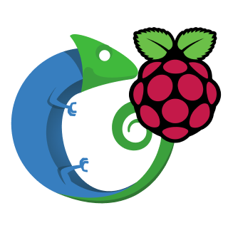

# chi-edge-workers

Balena fleet for enrolling edge devices into the CHI@Edge testbed. Each device runs
a k3s agent, a wireguard tunnel, and a coordinator that manages registration with
the Chameleon control plane.

## Release procedure

### 1. Local build validation

```bash
balena build --deviceType raspberrypi4-64 --arch aarch64
```

Run on every commit to `develop`. Catches Dockerfile syntax, missing files, broken
COPY paths. CI should run this as well.

### 2. Dev device push

```bash
./scripts/push_with_env.sh <DEVICE_UUID> <DEVICE_LOCAL_NAME>.local
```

Verify the service starts:

```bash
balena ssh <DEVICE_UUID> k3s
k3s kubectl get nodes
```

### 3. Canary staging

Push to the remote builder as a draft release, then deploy to the canary pool:

```bash
balena push chameleon/chi-edge-workers --draft
python scripts/canary.py deploy <RELEASE_ID>
python scripts/canary.py show
```

### 4. Smoke test

Run the external e2e suite against a canary device:

1. Reserve the device via CHI@Edge API
2. Launch a container (zun → k3s)
3. Access the container via IP over the wireguard tunnel

### 5. Promote or rollback

```bash
# Smoke tests pass: finalize the release (deploys to full fleet)
balena release finalize <RELEASE_ID>

# Smoke tests fail: roll canary devices back to stable
python scripts/canary.py rollback
```

### Git workflow

| Stage | Branch | Gate |
|-------|--------|------|
| PR | feature → `develop` | `balena build` passes |
| Staging | `develop` | Canary deploy + smoke tests pass |
| Production | `develop` → `main` | Full fleet rollout after canary soak |

## Wireguard kernel module build

The Wireguard kernel module is available on most newer kernels. However, some Balena
device types are sufficiently old as to not include it. The `install-wireguard.sh` will
lazily attempt to compile the kernel module on build.

Because builds will usually NOT happen on the target device, we will not be able to
reliably detect support for Wireguard in the kernel. Therefore, each type of device that
needs a custom build should be added to the `case` statement to point to the latest
available kernel header file. **N.B.**: the version is always the Balena kernel version
with a ".dev" suffix, from what I can tell.

## Balena guide

K3s agent state is stored in a Docker volume on the Balena host; this is helpful not
only because it means the state is not stored wastefully in an overlay filesystem, but
also means it persists across deployments. This also means that additional state may
need to be cleaned up if, e.g., the control plane radically changes and a fresh node
enrollment is appropriate. "Purge device" will clean up Docker volumes on the Balena
host to help with this.
